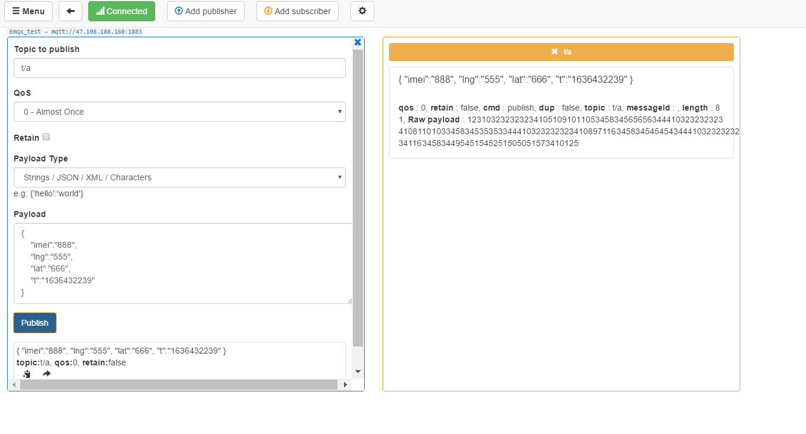

# 云服务器接口使用说明

## 云服务器公网ip

47.108.188.160

## 现提供MQTT-->1883端口

**账户test 密码test**

客户端我们统一topic为 **t/#** 

即为只要是   “t/”  开头的 后面跟什么信息都无所谓，这样我们后面可以设置为每台机器的独立信息，方便后面更改查询

### 上传内容

统一为JSON格式

{

​	“imei”:"xxx",

​	"lng":"xxx",

​	"lat":"xxx",

​	"t":"格式化时间戳"

}

其中时间戳为数字，例如**1636433703**，转换为正常时间戳为**2021-11-09 12:55:03**

如图所示

只要是这样的上传方式我们就会保存到数据库中（时间戳必须是格式化时间戳，并且必须是正常的时间戳，如果是什么5886年18月98日这种，mysql数据库保存不了），如图所示

## 保存接口-->47.108.188.160:8080/mqttLoad/testMqtt

如果不想通过mqtt，想直接保存到数据库中，可以按照相应格式直接post一个json到这个网址，格式如下

## 获取当前位置（查询最后一次所在位置）-->47.108.188.160:8080/mqttLoad/getSinGps?imei=xxx

这里通过get请求（这里建议使用get）获取对应imei（设备号）的在数据库中离当前时间最近的一次位置

示例如下

## 获取一段时间内的位置-->47.108.188.160:8080/mqttLoad/getGps?imei=xxx&sTime=xxx&eTime=xxx

通过get请求传递三个参数（imei，起始时间sTime，终止时间eTime），获取这段时间内的gps信息和上传时间，示例如下

## 注意事项

额，服务器的搭建后面会给大家总结，熟练了就不难，主要是mysql的配置搞了好久，现在服务器大部分东西都有，主流框架，docker，k8s等我都安好了，端口现在都是开放的，希望大家不要恶意访问mysql3306端口，这个配置的因为mysql8和ubuntu20.04不太兼容稍微动一下他就崩了，这也是我昨晚搞了一晚上的原因，其他的大家都可以测试用

